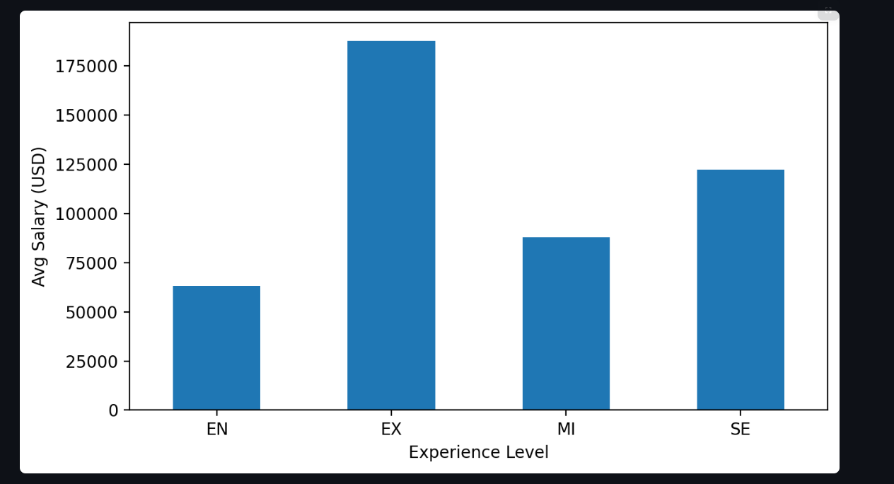
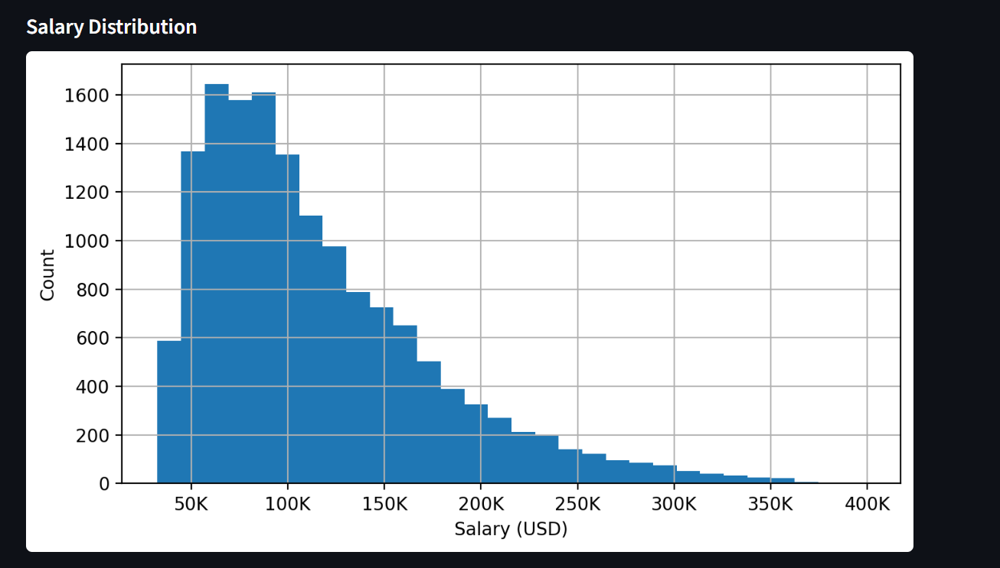
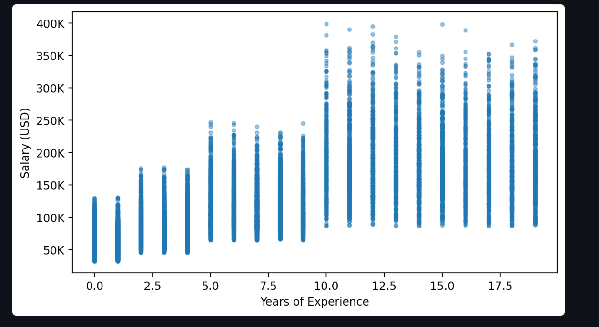
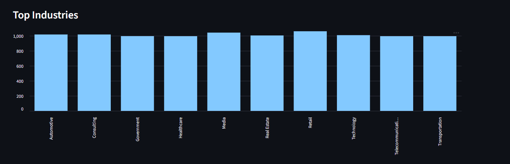
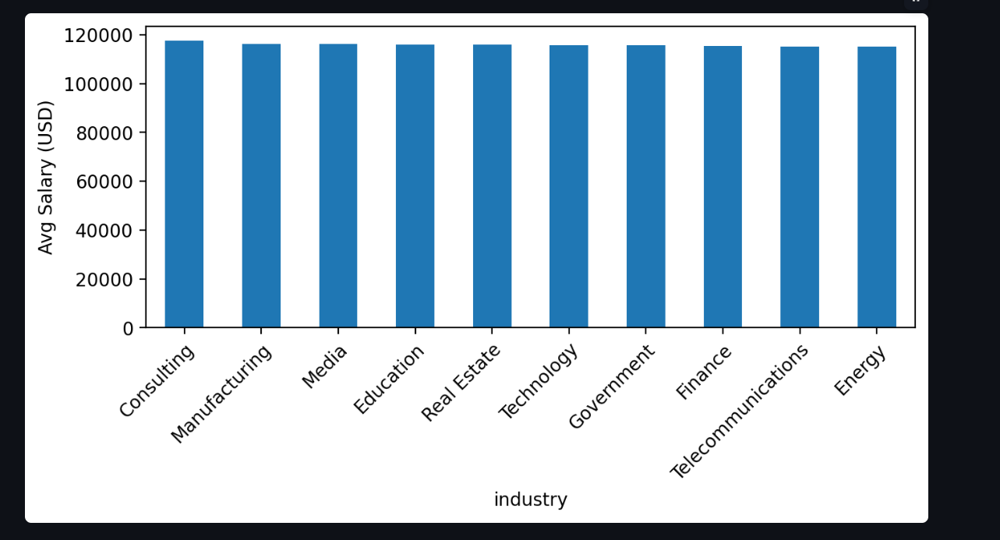
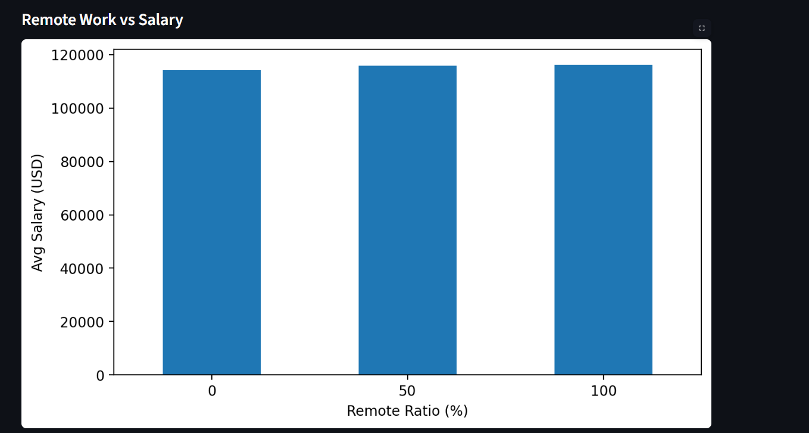
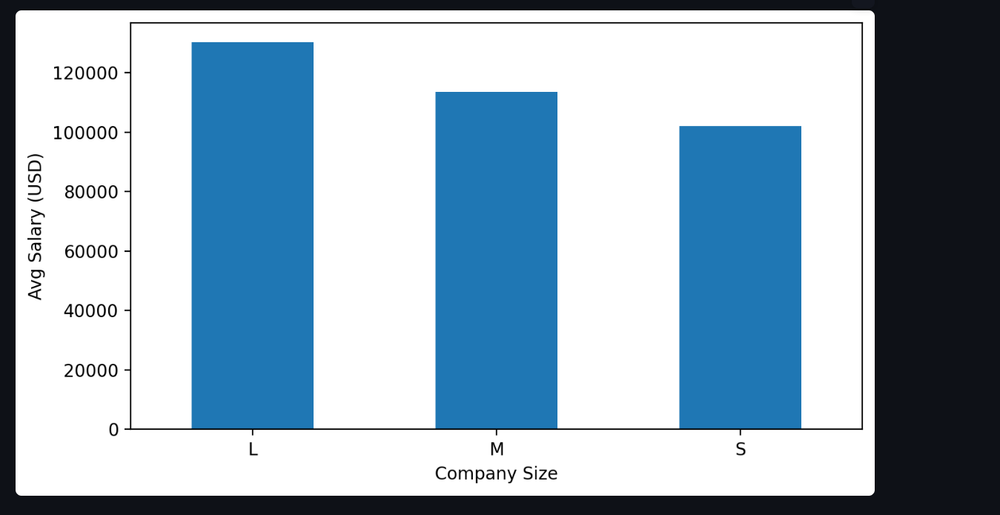
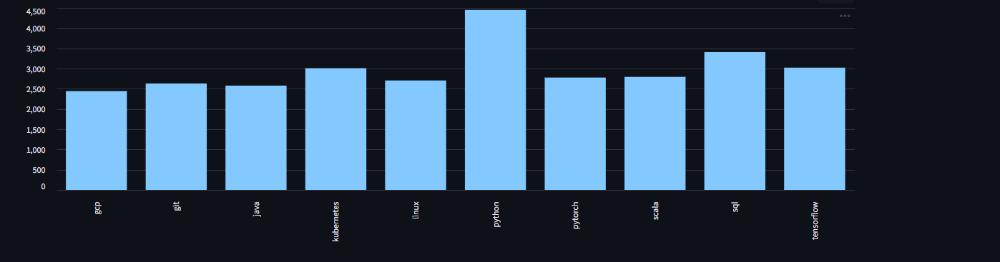
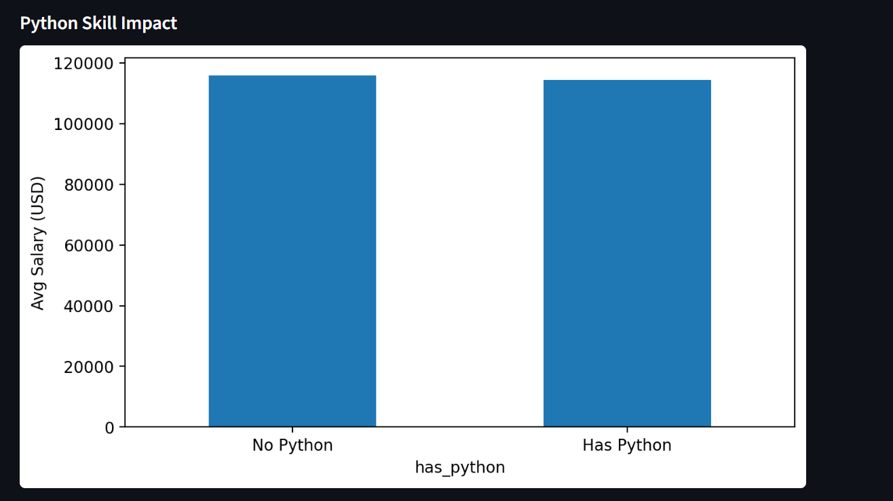

# 🚀 AI Job Market Intelligence Platform

> 📊 End-to-End Data Pipeline & Interactive Dashboard analyzing how AI is transforming the job market

---

## 🌟 Project Highlights

* 🔄 End-to-End Data Pipeline (Raw → Clean → Feature → Dashboard)
* 📊 Interactive Dashboard with real-time filters
* 🤖 AI & Python skill impact analysis
* 💰 Salary insights across experience & industries
* 🌍 Remote work and company size comparison

---

## 📸 Dashboard Preview

--- 

### 💰 Salary Analysis

#### 📊 Salary by Experience Level



> Salary increases significantly across levels: **EN → MI → SE → EX**

---

#### 📈 Salary Distribution



> Most jobs fall into mid-range salary, with fewer high-paying outliers

---

#### 📉 Experience vs Salary



> Positive relationship between years of experience and salary

---

### 🏭 Industry Analysis

#### 🏢 Top Industries



> Shows which industries are hiring the most

---

#### 💰 Top Paying Industries



> Highlights industries offering the highest salaries

---

### 🌍 Work Style Analysis

#### 🏠 Remote Work vs Salary



> Remote work has minimal impact on salary differences

---

#### 🏢 Company Size Impact



> Larger companies tend to offer higher salaries

---

### 🤖 Skills Analysis

#### 🧠 Top Skills



> Identifies the most in-demand skills in the job market

---

#### 🐍 Python Skill Impact



> Jobs requiring Python generally offer higher salaries

---

## 🎯 Business Questions Answered

* 💰 How does experience affect salary?
* 🤖 Do AI skills increase earning potential?
* 🌍 Does remote work impact salary?
* 🏭 Which industries pay the most?
* 🧠 What skills are most valuable?

---

## 🏗️ Data Pipeline Architecture

```
Raw Data (CSV)
        ↓
Data Ingestion
        ↓
Data Cleaning
        ↓
Feature Engineering
        ↓
Processed Data
        ↓
Dashboard (Streamlit)
```

---

## 📂 Project Structure

```
ai-job-market-project/
│
├── data/
├── src/
├── scripts/
├── images/
├── app.py
├── requirements.txt
└── README.md
```

---

## ⚙️ Installation

```bash
git clone https://github.com/your-username/ai-job-market-project.git
cd ai-job-market-project
pip install -r requirements.txt
```

---

## ▶️ Run Pipeline

```bash
python -m scripts.run_pipeline
```

---

## 🌐 Run Dashboard

```bash
streamlit run app.py
```

---

## 🧠 Key Insights

* Salary strongly increases with experience
* Python & AI skills correlate with higher salaries
* Remote work has little effect on salary
* Company size impacts compensation more than location
* Skills + experience are the main drivers of income

---

## 🛠️ Tech Stack

* Python
* Pandas
* Matplotlib
* Streamlit

---

⭐ If you find this project useful, give it a star!
